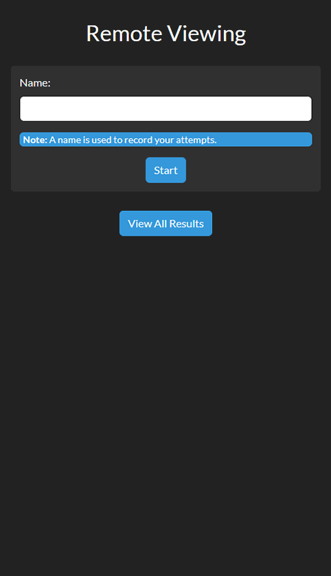
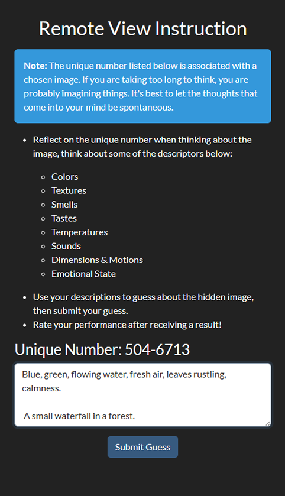
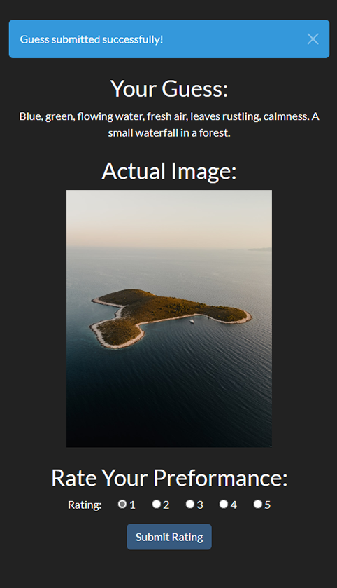
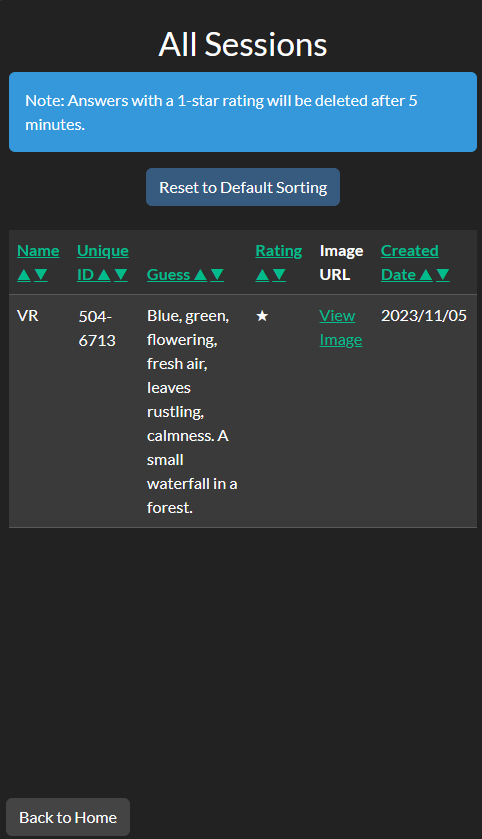

# Remote Viewing Application

## Overview

Remote Viewing is a simple web-based tool for practising remote viewing. Users predict the content of a specific image from Unsplash, which is determined by a pre-set associated number before revealment, ensuring consistency in the remote viewing experience.

## Screenshots






## Installation

1. Ensure Python 3.10 or above is installed.
2. Install the required packages:
```
pip install -r requirements.txt
```

## API Configuration

To use the application, you need to set up the environment with your API keys and configuration details.

### Initial Setup


1. Obtain a free Unsplash API developer account at [Unsplash Developers](https://unsplash.com/developers).

2. Create a copy of the `.env.example` file and rename it to `.env`.

3. Open the `.env` file and fill in your Unsplash API Access Key where it says `YOUR_UNSPLASH_ACCESS_KEY_HERE`.

4. Generate a secure Flask secret key and add it to the `.env` file in place of `YOUR_FLASK_SECRET_KEY_HERE`. This key is important for maintaining session security.

5. Define the clean-up schedule by setting `SCHEDULE_UNIT` (like 'minutes', 'hours', etc.) and `SCHEDULE_VALUE` (an integer) to determine how often old entries should be deleted.

```bash
# .env.example
UNSPLASH_ACCESS_KEY=YOUR_UNSPLASH_ACCESS_KEY_HERE
TZ=America/New_York
SCHEDULE_UNIT=minutes
SCHEDULE_VALUE=5
FLASK_SECRET_KEY=YOUR_FLASK_SECRET_KEY_HERE
DATABASE_URI=sqlite:///path_to_your_db
```

### Time Zone Configuration

- In `.env`, set the `TIMEZONE` variable to your local time zone, for example, `TIMEZONE='America/New_York'`. This will ensure that the application uses your local time zone for all operations. If you do not set this variable, it will default to 'UTC'.

### Final Steps

After configuring your `.env` file with the API key, secret key, schedule, and time zone settings, you're ready to start the application.


## Launching

Navigate to the directory containing `app.py` and run:
```
python app.py
```

## Features

- **User Sessions**: Initiate with a name.
- **Image Retrieval**: Random images sourced from Unsplash.
- **Guess Submission**: Users store their predictions.
- **Reveal and Score**: Users view the actual image and self-rate.
- **Result Logs**: Review past sessions.
- **Auto Cleanup**: Periodically deletes old low-rated entries based on settings.

## Background Scheduler

The application includes a scheduler that deletes old sessions with a rating of 1 after a specified duration. This can be configured using `SCHEDULE_UNIT` and `SCHEDULE_VALUE`, which can be adjusted in your `.env` file.


## Deployment

For production on Linux, serve using gunicorn:

### Start with Gunicorn

```sh
gunicorn wsgi:app --bind 0.0.0.0:5000 -w 4 --timeout 300
```

To start the application in the background using `nohup`:

```sh
nohup gunicorn wsgi:app --bind 0.0.0.0:5000 -w 4 --timeout 300 > output.log 2>&1 &
```

### Worker and Timeout Notes

- `-w` defines worker processes. Adjust based on load and resources.
- `--timeout` defines seconds before worker restart. Ensure it exceeds the maximum duration of the `delete_old_entries` function.

### WSGI Configuration

The `wsgi.py` file is set up to handle proxy servers and ensures secure connections with HTTPS. If required, you can adjust the default port for Flask, which is 5000.

```python
from werkzeug.middleware.proxy_fix import ProxyFix
from app import app

app.config['PREFERRED_URL_SCHEME'] = 'https'
app.wsgi_app = ProxyFix(app.wsgi_app, x_for=1, x_proto=1)

# Change port if required: default is 5000 for flask
if __name__ == '__main__':
    app.run(debug=False, port=5000)

# create a WSGI application object
application = app
```

### Stopping

Kill the gunicorn process:
```
pkill gunicorn
```

## Docker Deployment

The application can be containerized for Docker, but note that the Docker image is not available in a public Docker repository. You will need to build your own image using the supplied `Dockerfile`.

### Building the Docker Image
```Dockerfile
# Use an official Python runtime as a parent image
FROM python:3.10-slim

# Set the working directory in the container
WORKDIR /usr/src/app

# Copy the current directory contents into the container at /usr/src/app
COPY . .

# Install any needed packages specified in requirements.txt
RUN pip install --no-cache-dir -r requirements.txt

# Make port 5000 available to the world outside this container
EXPOSE 5000

# Run app.py when the container launches
CMD ["gunicorn", "app:app", "--bind", "0.0.0.0:5000", "-w", "4", "--timeout", "300"]
```


To build the Docker image, navigate to the directory containing the `Dockerfile` and execute the following command:

```sh
docker build -t remoteviewing:latest .
```

## Using Docker Compose
You can use Docker Compose to define and run the application with a YAML file.

Create a `docker-compose.yaml` file with the following content:

```yaml
version: '3.8' 
services:
  remote-viewing:
    container_name: remote-viewing
    image: remoteviewing:latest
    ports:
      - "5000:5000" # Host to container port mapping.
    environment:
      - UNSPLASH_ACCESS_KEY=YOUR_UNSPLASH_ACCESS_KEY_HERE # Replace with your actual Unsplash access key.
      - TZ=America/New_York # Set the timezone for the Docker container.
      - SCHEDULE_UNIT=minutes # Unit of time for scheduling. Options: "seconds", "minutes", "hours", etc.
      - SCHEDULE_VALUE=5 # The value for the scheduling. Can be replaced with any integer.
      - FLASK_SECRET_KEY=YOUR_FLASK_SECRET_KEY_HERE # Replace with your actual Flask secret key.
      - DATABASE_URI=sqlite:////data/remote_viewing.db # URI for the database. Change if your database is located elsewhere.
    volumes:
      - /srv/docker/remoteviewing:/data # Standard Linux path for Docker volumes.
    restart: unless-stopped # Container restart policy.
```

To start the application with Docker Compose, run:

```sh
docker-compose up -d
```

## Setting Up Volumes

When deploying with Docker, it's essential to persist your database using Docker volumes. In the `docker-compose.yaml` example above, `/srv/docker/remoteviewing` is the host directory that will be mounted as a volume at `/data` in the container.

Ensure you create the directory on the host and set the correct permissions:

```sh
sudo mkdir -p /srv/docker/remoteviewing
sudo chmod -R 755 /srv/docker/remoteviewing
```
